# Tracer report: `parquet_feature_inference`

Generated by the disposable whole-program tracer (S03-T3).

## Summary

* **Total events:** 88
* **Total recorded work:** 409.031 ms
* **Critical path (span):** 397.879 ms
* **Max theoretical speedup:** 1.03x
* **Estimated transfer boundaries:** 6
* **Candidate parallel regions:** 8

## Top 5 critical-path operations

| Rank | Op | Duration | % of span |
|------|----|----------|-----------|
| 1 | `torch.TensorBase.to` | 129.891 ms | 32.6% |
| 2 | `pandas.read_parquet` | 104.260 ms | 26.2% |
| 3 | `torch._C._nn.linear` | 68.329 ms | 17.2% |
| 4 | `torch._C._nn.linear` | 32.064 ms | 8.1% |
| 5 | `torch._VariableFunctionsClass.relu` | 24.626 ms | 6.2% |

## Transfer boundaries

Detected 6 explicit host/device transfer(s); total estimated transfer time: 131.553 ms.
Aggregated by op, source, and target below.

| Op | Source | Target | Count | Total | Max node |
|----|--------|--------|-------|-------|----------|
| `torch.TensorBase.to` | cpu | cuda:0 | 5 | 130.978 ms | 75 |
| `torch.TensorBase.to` | cuda:0 | cpu | 1 | 574.686 us | 82 |

## Device residency timeline

Showing the 5 host/device transition point(s).

| Node | Op | Device |
|------|----|--------|
| 0 | `pandas.read_parquet` | CPU |
| 40 | `torch.TensorBase.to` | GPU |
| 41 | `torch._VariableFunctionsClass.empty` | CPU |
| 60 | `torch.TensorBase.to` | GPU |
| 82 | `torch.TensorBase.to` | CPU |

## Candidate parallel regions

Showing the top 5 regions by parallelizable work.

### Region 1: `pandas.read_parquet` (node 0) → `pandas.Series.__and__` (node 8)

* Branch nodes: [1, 5]
* Region span (sequential): 113.293 ms
* Parallelizable work overlap opportunity: 3.790 ms

### Region 2: `pandas.read_parquet` (node 0) → `pandas.Series.__and__` (node 8)

* Branch nodes: [3, 5]
* Region span (sequential): 113.293 ms
* Parallelizable work overlap opportunity: 589.774 us

### Region 3: `pandas.DataFrame.copy` (node 12) → `pandas.Series.__add__` (node 18)

* Branch nodes: [13, 16]
* Region span (sequential): 1.374 ms
* Parallelizable work overlap opportunity: 394.932 us

### Region 4: `pandas.DataFrame.copy` (node 12) → `pandas.Series.__add__` (node 18)

* Branch nodes: [14, 16]
* Region span (sequential): 1.374 ms
* Parallelizable work overlap opportunity: 394.932 us

### Region 5: `pandas.DataFrame.to_numpy` (node 29) → `numpy.divide` (node 35)

* Branch nodes: [30, 31]
* Region span (sequential): 5.589 ms
* Parallelizable work overlap opportunity: 219.022 us

## Rendered DAG (Graphviz DOT)

```dot
digraph cobra_trace {
  rankdir=LR;
  0 [label="pandas.read_parquet" shape=cylinder];
  1 [label="pandas.DataFrame.__getitem__" shape=cylinder];
  2 [label="pandas.Series.__gt__" shape=cylinder];
  3 [label="pandas.DataFrame.__getitem__" shape=cylinder];
  4 [label="pandas.Series.__and__" shape=cylinder];
  5 [label="pandas.DataFrame.__getitem__" shape=cylinder];
  6 [label="pandas.Series.__invert__" shape=cylinder];
  7 [label="pandas.Series.notna" shape=cylinder];
  8 [label="pandas.Series.__and__" shape=cylinder];
  9 [label="pandas.DataFrame.__getitem__" shape=cylinder];
  10 [label="pandas.DataFrame.copy" shape=cylinder];
  11 [label="pandas.DataFrame.reset_index" shape=cylinder];
  12 [label="pandas.DataFrame.copy" shape=cylinder];
  13 [label="pandas.DataFrame.__getitem__" shape=cylinder];
  14 [label="pandas.DataFrame.__getitem__" shape=cylinder];
  15 [label="pandas.Series.__mul__" shape=cylinder];
  16 [label="pandas.DataFrame.__getitem__" shape=cylinder];
  17 [label="pandas.Series.astype" shape=cylinder];
  18 [label="pandas.Series.__add__" shape=cylinder];
  19 [label="pandas.DataFrame.__setitem__" shape=cylinder];
  20 [label="pandas.DataFrame.__getitem__" shape=cylinder];
  21 [label="pandas.Series.fillna" shape=cylinder];
  22 [label="pandas.DataFrame.__setitem__" shape=cylinder];
  23 [label="pandas.DataFrame.__getitem__" shape=cylinder];
  24 [label="pandas.DataFrame.__init__" shape=cylinder];
  25 [label="pandas.get_dummies" shape=cylinder];
  26 [label="pandas.concat" shape=cylinder];
  27 [label="pandas.DataFrame.__getitem__" shape=cylinder];
  28 [label="pandas.DataFrame.astype" shape=cylinder];
  29 [label="pandas.DataFrame.to_numpy" shape=cylinder];
  30 [label="numpy.mean" shape=ellipse];
  31 [label="numpy.std" shape=ellipse];
  32 [label="numpy.equal" shape=ellipse];
  33 [label="numpy.where" shape=ellipse];
  34 [label="numpy.subtract" shape=ellipse];
  35 [label="numpy.divide" shape=ellipse];
  36 [label="pandas.DataFrame.__init__" shape=cylinder];
  37 [label="torch.device" shape=box];
  38 [label="pandas.DataFrame.to_numpy" shape=cylinder];
  39 [label="torch.from_numpy" shape=box];
  40 [label="torch.TensorBase.to" shape=box];
  41 [label="torch._VariableFunctionsClass.empty" shape=box];
  42 [label="torch._VariableFunctionsClass.empty" shape=box];
  43 [label="torch.nn.init.kaiming_uniform_" shape=box];
  44 [label="torch.TensorBase.dim" shape=box];
  45 [label="torch.TensorBase.size" shape=box];
  46 [label="torch.TensorBase.size" shape=box];
  47 [label="torch.TensorBase.dim" shape=box];
  48 [label="torch.nn.init.uniform_" shape=box];
  49 [label="torch._VariableFunctionsClass.empty" shape=box];
  50 [label="torch._VariableFunctionsClass.empty" shape=box];
  51 [label="torch.nn.init.kaiming_uniform_" shape=box];
  52 [label="torch.TensorBase.dim" shape=box];
  53 [label="torch.TensorBase.size" shape=box];
  54 [label="torch.TensorBase.size" shape=box];
  55 [label="torch.TensorBase.dim" shape=box];
  56 [label="torch.nn.init.uniform_" shape=box];
  57 [label="torch._C._nn._parse_to" shape=box];
  58 [label="torch._C._set_grad_enabled" shape=box];
  59 [label="torch.TensorBase.is_floating_point" shape=box];
  60 [label="torch.TensorBase.to" shape=box];
  61 [label="torch._C._set_grad_enabled" shape=box];
  62 [label="torch._VariableFunctionsClass._has_compatible_shallow_copy_type" shape=box];
  63 [label="torch._C._set_grad_enabled" shape=box];
  64 [label="torch.TensorBase.is_floating_point" shape=box];
  65 [label="torch.TensorBase.to" shape=box];
  66 [label="torch._C._set_grad_enabled" shape=box];
  67 [label="torch._VariableFunctionsClass._has_compatible_shallow_copy_type" shape=box];
  68 [label="torch._C._set_grad_enabled" shape=box];
  69 [label="torch.TensorBase.is_floating_point" shape=box];
  70 [label="torch.TensorBase.to" shape=box];
  71 [label="torch._C._set_grad_enabled" shape=box];
  72 [label="torch._VariableFunctionsClass._has_compatible_shallow_copy_type" shape=box];
  73 [label="torch._C._set_grad_enabled" shape=box];
  74 [label="torch.TensorBase.is_floating_point" shape=box];
  75 [label="torch.TensorBase.to" shape=box];
  76 [label="torch._C._set_grad_enabled" shape=box];
  77 [label="torch._VariableFunctionsClass._has_compatible_shallow_copy_type" shape=box];
  78 [label="torch._C._nn.linear" shape=box];
  79 [label="torch._VariableFunctionsClass.relu" shape=box];
  80 [label="torch._C._nn.linear" shape=box];
  81 [label="torch.TensorBase.squeeze" shape=box];
  82 [label="torch.TensorBase.to" shape=box];
  83 [label="torch.TensorBase.numpy" shape=box];
  84 [label="numpy.mean" shape=ellipse];
  85 [label="numpy.percentile" shape=ellipse];
  86 [label="numpy.percentile" shape=ellipse];
  87 [label="numpy.sum" shape=ellipse];
  0 -> 1 [style=solid];
  0 -> 3 [style=solid];
  0 -> 5 [style=solid];
  0 -> 9 [style=solid];
  1 -> 2 [style=solid];
  2 -> 4 [style=solid];
  3 -> 4 [style=solid];
  4 -> 8 [style=solid];
  5 -> 7 [style=solid];
  6 -> 7 [style=dashed];
  7 -> 8 [style=solid];
  8 -> 9 [style=solid];
  9 -> 10 [style=solid];
  9 -> 11 [style=solid];
  10 -> 11 [style=dashed];
  11 -> 12 [style=solid];
  12 -> 13 [style=solid];
  12 -> 14 [style=solid];
  12 -> 16 [style=solid];
  12 -> 19 [style=solid];
  12 -> 19 [style=dashed];
  13 -> 15 [style=solid];
  13 -> 19 [style=dashed];
  14 -> 15 [style=solid];
  14 -> 19 [style=dashed];
  15 -> 18 [style=solid];
  16 -> 17 [style=solid];
  16 -> 19 [style=dashed];
  17 -> 18 [style=solid];
  18 -> 19 [style=solid];
  19 -> 20 [style=solid];
  19 -> 22 [style=solid];
  19 -> 22 [style=dashed];
  20 -> 21 [style=solid];
  20 -> 22 [style=dashed];
  21 -> 22 [style=solid];
  22 -> 23 [style=solid];
  22 -> 26 [style=solid];
  23 -> 25 [style=solid];
  24 -> 25 [style=dashed];
  25 -> 26 [style=solid];
  26 -> 27 [style=solid];
  27 -> 28 [style=solid];
  28 -> 29 [style=solid];
  29 -> 30 [style=solid];
  29 -> 31 [style=solid];
  29 -> 34 [style=solid];
  30 -> 34 [style=solid];
  31 -> 32 [style=solid];
  31 -> 33 [style=solid];
  32 -> 33 [style=solid];
  33 -> 35 [style=solid];
  34 -> 35 [style=solid];
  35 -> 36 [style=solid];
  35 -> 38 [style=dashed];
  36 -> 38 [style=solid];
  36 -> 38 [style=dashed];
  38 -> 39 [style=solid];
  39 -> 40 [style=solid];
  40 -> 78 [style=solid];
  41 -> 43 [style=solid];
  41 -> 43 [style=dashed];
  42 -> 48 [style=solid];
  42 -> 48 [style=dashed];
  43 -> 44 [style=solid];
  43 -> 45 [style=solid];
  43 -> 46 [style=solid];
  43 -> 47 [style=solid];
  43 -> 59 [style=solid];
  43 -> 60 [style=solid];
  43 -> 62 [style=solid];
  43 -> 78 [style=solid];
  48 -> 64 [style=solid];
  48 -> 65 [style=solid];
  48 -> 67 [style=solid];
  48 -> 78 [style=solid];
  49 -> 51 [style=solid];
  49 -> 51 [style=dashed];
  50 -> 56 [style=solid];
  50 -> 56 [style=dashed];
  51 -> 52 [style=solid];
  51 -> 53 [style=solid];
  51 -> 54 [style=solid];
  51 -> 55 [style=solid];
  51 -> 69 [style=solid];
  51 -> 70 [style=solid];
  51 -> 72 [style=solid];
  51 -> 80 [style=solid];
  56 -> 74 [style=solid];
  56 -> 75 [style=solid];
  56 -> 77 [style=solid];
  56 -> 80 [style=solid];
  60 -> 62 [style=solid];
  60 -> 78 [style=solid];
  65 -> 67 [style=solid];
  65 -> 78 [style=solid];
  70 -> 72 [style=solid];
  70 -> 80 [style=solid];
  75 -> 77 [style=solid];
  75 -> 80 [style=solid];
  78 -> 79 [style=solid];
  79 -> 80 [style=solid];
  80 -> 81 [style=solid];
  80 -> 82 [style=solid];
  81 -> 82 [style=solid];
  82 -> 83 [style=solid];
  83 -> 84 [style=solid];
  83 -> 85 [style=solid];
  83 -> 86 [style=solid];
  83 -> 87 [style=solid];
}
```

