# Tracer report: `parquet_feature_inference`

Generated by the disposable whole-program tracer (S03-T3).

## Summary

* **Total events:** 74
* **Total recorded work:** 374.295 ms
* **Critical path (span):** 262.919 ms
* **Max theoretical speedup:** 1.42x
* **Estimated transfer boundaries:** 6
* **Candidate parallel regions:** 0

## Top 5 critical-path operations

| Rank | Op | Duration | % of span |
|------|----|----------|-----------|
| 1 | `torch.TensorBase.to` | 134.437 ms | 51.1% |
| 2 | `torch._C._nn.linear` | 70.178 ms | 26.7% |
| 3 | `torch._C._nn.linear` | 31.460 ms | 12.0% |
| 4 | `torch._VariableFunctionsClass.relu` | 25.616 ms | 9.7% |
| 5 | `torch.TensorBase.to` | 621.502 us | 0.2% |

## Transfer boundaries

Detected 6 explicit host/device transfer(s); total estimated transfer time: 135.765 ms.
Aggregated by op, source, and target below.

| Op | Source | Target | Count | Total | Max node |
|----|--------|--------|-------|-------|----------|
| `torch.TensorBase.to` | cpu | cuda:0 | 5 | 135.144 ms | 63 |
| `torch.TensorBase.to` | cuda:0 | cpu | 1 | 621.502 us | 72 |

## Device residency timeline

Showing the 5 host/device transition point(s).

| Node | Op | Device |
|------|----|--------|
| 0 | `pandas.read_parquet` | CPU |
| 17 | `torch.TensorBase.to` | GPU |
| 19 | `torch._VariableFunctionsClass.empty` | CPU |
| 42 | `torch.TensorBase.to` | GPU |
| 72 | `torch.TensorBase.to` | CPU |

## Candidate parallel regions

No fork/join parallel regions detected in this trace.

## Rendered DAG (Graphviz DOT)

```dot
digraph cobra_trace {
  rankdir=LR;
  0 [label="pandas.read_parquet" shape=cylinder];
  1 [label="pandas.DataFrame.__getitem__" shape=cylinder];
  2 [label="pandas.DataFrame.__getitem__" shape=cylinder];
  3 [label="pandas.DataFrame.__getitem__" shape=cylinder];
  4 [label="pandas.DataFrame.__getitem__" shape=cylinder];
  5 [label="pandas.DataFrame.__getitem__" shape=cylinder];
  6 [label="pandas.DataFrame.__getitem__" shape=cylinder];
  7 [label="pandas.DataFrame.__getitem__" shape=cylinder];
  8 [label="pandas.Series.astype" shape=cylinder];
  9 [label="pandas.DataFrame.__getitem__" shape=cylinder];
  10 [label="pandas.Series.fillna" shape=cylinder];
  11 [label="pandas.DataFrame.__getitem__" shape=cylinder];
  12 [label="pandas.DataFrame.__getitem__" shape=cylinder];
  13 [label="pandas.DataFrame.astype" shape=cylinder];
  14 [label="pandas.DataFrame.to_numpy" shape=cylinder];
  15 [label="torch.device" shape=box];
  16 [label="pandas.DataFrame.to_numpy" shape=cylinder];
  17 [label="torch.TensorBase.to" shape=box];
  18 [label="torch.getset_descriptor.__get__" shape=box];
  19 [label="torch._VariableFunctionsClass.empty" shape=box];
  20 [label="torch.getset_descriptor.__get__" shape=box];
  21 [label="torch._VariableFunctionsClass.empty" shape=box];
  22 [label="torch.getset_descriptor.__get__" shape=box];
  23 [label="torch.nn.init.kaiming_uniform_" shape=box];
  24 [label="torch.TensorBase.dim" shape=box];
  25 [label="torch.TensorBase.size" shape=box];
  26 [label="torch.TensorBase.size" shape=box];
  27 [label="torch.TensorBase.dim" shape=box];
  28 [label="torch.nn.init.uniform_" shape=box];
  29 [label="torch._VariableFunctionsClass.empty" shape=box];
  30 [label="torch.getset_descriptor.__get__" shape=box];
  31 [label="torch._VariableFunctionsClass.empty" shape=box];
  32 [label="torch.getset_descriptor.__get__" shape=box];
  33 [label="torch.nn.init.kaiming_uniform_" shape=box];
  34 [label="torch.TensorBase.dim" shape=box];
  35 [label="torch.TensorBase.size" shape=box];
  36 [label="torch.TensorBase.size" shape=box];
  37 [label="torch.TensorBase.dim" shape=box];
  38 [label="torch.nn.init.uniform_" shape=box];
  39 [label="torch._C._nn._parse_to" shape=box];
  40 [label="torch._C._set_grad_enabled" shape=box];
  41 [label="torch.TensorBase.is_floating_point" shape=box];
  42 [label="torch.TensorBase.to" shape=box];
  43 [label="torch._C._set_grad_enabled" shape=box];
  44 [label="torch._VariableFunctionsClass._has_compatible_shallow_copy_type" shape=box];
  45 [label="torch.getset_descriptor.__get__" shape=box];
  46 [label="torch.getset_descriptor.__set__" shape=box];
  47 [label="torch._C._set_grad_enabled" shape=box];
  48 [label="torch.TensorBase.is_floating_point" shape=box];
  49 [label="torch.TensorBase.to" shape=box];
  50 [label="torch._C._set_grad_enabled" shape=box];
  51 [label="torch._VariableFunctionsClass._has_compatible_shallow_copy_type" shape=box];
  52 [label="torch.getset_descriptor.__get__" shape=box];
  53 [label="torch.getset_descriptor.__set__" shape=box];
  54 [label="torch._C._set_grad_enabled" shape=box];
  55 [label="torch.TensorBase.is_floating_point" shape=box];
  56 [label="torch.TensorBase.to" shape=box];
  57 [label="torch._C._set_grad_enabled" shape=box];
  58 [label="torch._VariableFunctionsClass._has_compatible_shallow_copy_type" shape=box];
  59 [label="torch.getset_descriptor.__get__" shape=box];
  60 [label="torch.getset_descriptor.__set__" shape=box];
  61 [label="torch._C._set_grad_enabled" shape=box];
  62 [label="torch.TensorBase.is_floating_point" shape=box];
  63 [label="torch.TensorBase.to" shape=box];
  64 [label="torch._C._set_grad_enabled" shape=box];
  65 [label="torch._VariableFunctionsClass._has_compatible_shallow_copy_type" shape=box];
  66 [label="torch.getset_descriptor.__get__" shape=box];
  67 [label="torch.getset_descriptor.__set__" shape=box];
  68 [label="torch._C._nn.linear" shape=box];
  69 [label="torch._VariableFunctionsClass.relu" shape=box];
  70 [label="torch._C._nn.linear" shape=box];
  71 [label="torch.TensorBase.squeeze" shape=box];
  72 [label="torch.TensorBase.to" shape=box];
  73 [label="torch.TensorBase.numpy" shape=box];
  0 -> 1 [style=solid];
  0 -> 2 [style=solid];
  0 -> 3 [style=solid];
  0 -> 4 [style=solid];
  7 -> 8 [style=solid];
  9 -> 10 [style=solid];
  10 -> 11 [style=dashed];
  12 -> 13 [style=solid];
  13 -> 14 [style=solid];
  17 -> 18 [style=solid];
  17 -> 68 [style=solid];
  19 -> 20 [style=solid];
  19 -> 23 [style=solid];
  19 -> 23 [style=dashed];
  21 -> 22 [style=solid];
  21 -> 28 [style=solid];
  21 -> 28 [style=dashed];
  23 -> 24 [style=solid];
  23 -> 25 [style=solid];
  23 -> 26 [style=solid];
  23 -> 27 [style=solid];
  23 -> 41 [style=solid];
  23 -> 42 [style=solid];
  23 -> 44 [style=solid];
  23 -> 45 [style=solid];
  28 -> 48 [style=solid];
  28 -> 49 [style=solid];
  28 -> 51 [style=solid];
  28 -> 52 [style=solid];
  29 -> 30 [style=solid];
  29 -> 33 [style=solid];
  29 -> 33 [style=dashed];
  31 -> 32 [style=solid];
  31 -> 38 [style=solid];
  31 -> 38 [style=dashed];
  33 -> 34 [style=solid];
  33 -> 35 [style=solid];
  33 -> 36 [style=solid];
  33 -> 37 [style=solid];
  33 -> 55 [style=solid];
  33 -> 56 [style=solid];
  33 -> 58 [style=solid];
  33 -> 59 [style=solid];
  38 -> 62 [style=solid];
  38 -> 63 [style=solid];
  38 -> 65 [style=solid];
  38 -> 66 [style=solid];
  42 -> 44 [style=solid];
  42 -> 46 [style=solid];
  42 -> 68 [style=solid];
  49 -> 51 [style=solid];
  49 -> 53 [style=solid];
  49 -> 68 [style=solid];
  56 -> 58 [style=solid];
  56 -> 60 [style=solid];
  56 -> 70 [style=solid];
  63 -> 65 [style=solid];
  63 -> 67 [style=solid];
  63 -> 70 [style=solid];
  68 -> 69 [style=solid];
  69 -> 70 [style=solid];
  70 -> 71 [style=solid];
  70 -> 71 [style=dashed];
  71 -> 72 [style=solid];
  72 -> 73 [style=solid];
}
```

